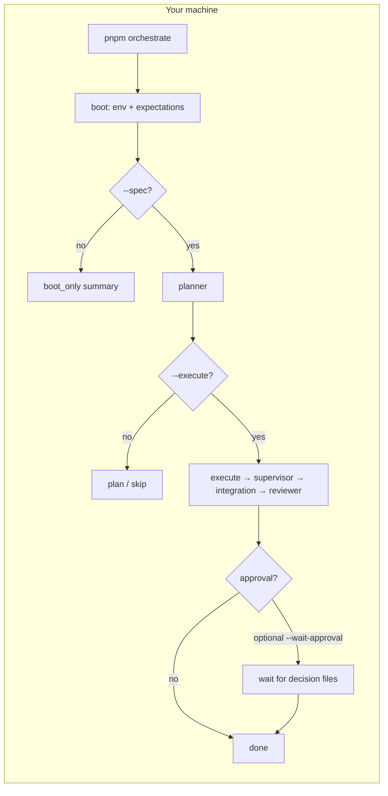
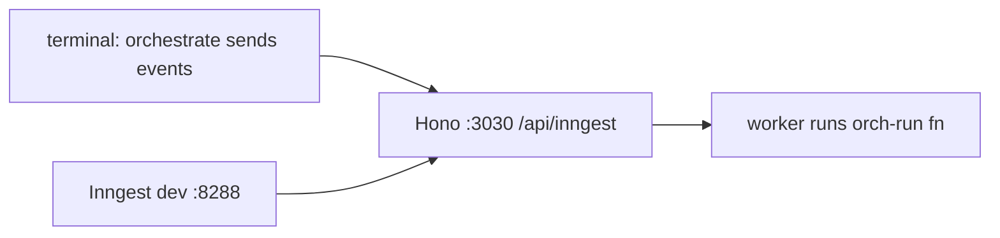

# agent-orchestrator

**What:** repo runs a **local** “orchestrator” PoC: load config, optionally read a **spec** `.md`, **plan** work, optionally **execute** (mock/real per env), run **gates**, maybe stop for **human approval**, then finish.

Not a cloud product doc — dev machine + optional Inngest dev UI.

---

## Picture: CLI path (no cloud required)



**Deeper diagram:** [`docs/architecture/runtime-flow.md`](docs/architecture/runtime-flow.md).

---

## Picture: optional Inngest (local stack)

Same flows can be **driven by events** instead of only inline CLI: Hono serves `/api/inngest`; Inngest dev UI talks to it.



```bash
# one terminal — app + Inngest UI
pnpm run inngest:devstack
```

Dry plan / run URLs print from CLI when you use `--spec` (see `.env.example` for signing keys).

**Execute path with mock lane:** set `MOCK_TF=1` on the **worker** when you fire `orch/run.requested`. Align `ORCH_MANAGED_REPOS` with local CLI if plans touch those repos.

---

## Quick start

```bash
pnpm install
cp .env.example .env   # optional; needed for Inngest serve / strict checks

pnpm run test:run
pnpm run orchestrate   # no spec → boot-only
```

With a tiny fixture spec:

```bash
pnpm run orchestrate -- --spec fixtures/no-op.md
# add --execute for run lane; add --wait-approval to block until approval files exist
```

**Approval wait exit codes:** `0` = all approved, `1` = rejection, `2` = timeout / still pending.

```bash
pnpm run orchestrate -- --spec fixtures/no-op.md --execute --wait-approval
```

Artifacts / viewer routes (same host as `/api/inngest`): e.g. `/runs/<runId>/audit`, `.../pending.diff`, `.../approval.md`. Set `ORCH_ARTIFACT_BASE_URL` if you need stable URLs in summaries.

**Gates check without planner/LLM** (local clones + toolchains):

```bash
pnpm run orchestrate -- --gates-verify
```

---

## Commands you actually touch

| command | does |
| --- | --- |
| `pnpm run orchestrate` | main CLI |
| `pnpm run test:run` | tests |
| `pnpm run inngest:devstack` | `:3030` + Inngest UI `:8288` |
| `pnpm run quality` | typecheck + lint + tests + guards (heavy) |
| `pnpm run ci` | full CI lane — **see `AGENTS.md`** |

| extra | does |
| --- | --- |
| `pnpm run approve` / `pnpm run reject` | write per-supervisor decision files |
| `pnpm run audit:verify` | check audit JSONL chain |
| `pnpm run scorecard` | roll up audit into scorecard |
| `pnpm run verify:inngest-outbound` | outbound triage helper (ADR / policy) |

---

## Playbook pin (A3)

Canonical checklist + SHA lives in **`docs/playbook-expectations.md`**. **`pnpm run pin:check`** verifies repo matches pin. Optional strict env: `EXPECTED_VAULT_SHA`, `STRICT_EXPECTATIONS=1` — see `src/config/env.ts` / `.env.example`.

---

## More detail

- **Quality bar, layers, CI:** `AGENTS.md`
- **ADR Inngest:** `docs/decisions/2026-05-04-0002-inngest-outer-durable-shell.md`
- **Vault build kit** (external): `Development/Vibe Coding Hardening/Orchestration PoC/Build/`
