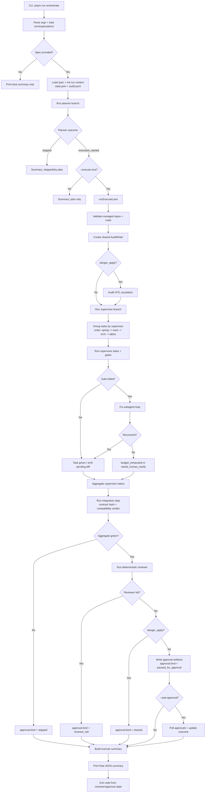

# Runtime Flow

Full orchestrator runtime flow from CLI entry to final summary/exit code.

Viewer endpoints (served by Hono alongside `/api/inngest`):

- `/runs/<runId>/audit`
- `/runs/<runId>/<supervisor>/pending.diff`
- `/runs/<runId>/<supervisor>/approval.md`
