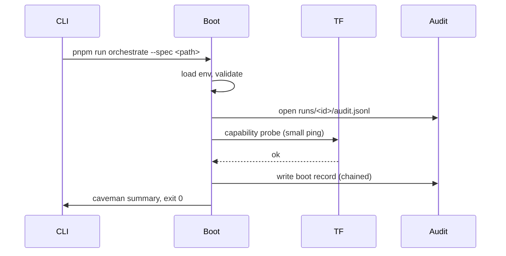

# Design — Orchestrator bootstrap

Mirrors vault `Examples/docs/specs/2026-05-02-orchestrator-bootstrap/design.md`.

## Components touched

| Layer            | Component / file                              | Change |
| ---------------- | --------------------------------------------- | ------ |
| project root     | `package.json`, `pnpm-lock.yaml`, `tsconfig.json` | new |
| boot             | `src/index.ts`                                | new    |
| CLI              | `src/cli/orchestrate.ts`                      | new    |
| TF client        | `src/tf/client.ts`                            | new    |
| audit writer     | `src/audit/jsonl.ts`                          | new    |
| audit verifier   | `src/audit/verify.ts`                         | new    |
| run state        | `src/runs/state.ts`                           | new    |
| config           | `.env.example`, `src/config/env.ts`           | new    |
| README           | `README.md`                                   | new    |
| no-op spec       | `specs/no-op.md`                              | new    |
| tests            | `tests/audit.test.ts`, `tests/tf-client.test.ts`, `tests/cli.test.ts` | new |
| expectations     | `src/config/expectations.ts`                  | new (SF1) |
| planner dry-run  | `src/planner/plannerDryRun.ts`                | new (SF2) |
| policy / HITL    | `src/policy/hitl.ts`                          | new (SF5) |
| prompt assemble  | `src/llm/assemblePrompt.ts`                   | new (SF4) |

## Self-fidelity parity (runtime mirrors vault plan)

Orchestrator **enforces** same spine as vault `Build/Playbook Fidelity Plan` + `Build/Playbook`: **A3** expectations snapshot, **O5** pre-planner skip, **A4** `--dry-plan` stop before managed repos, **B** bounded context on assemble, **C** HITL categories → pause/audit, **telemetry** on scorecard path.

Chunked build + **human between chunks**: vault `Orchestrator Self-Fidelity Parity`. Tasks **21–34** in `tasks.md`.

## Inngest (optional durable shell)

**Outer:** Inngest functions + steps + retries + `waitForEvent`. **Inner:** Mastra agents/workflows invoked **only** from `step.run` (vault `Inngest Integration Plan`). Tasks **35–46** in `tasks.md` — gated behind ADR 0003 + 37a outbound-verify + 37a tcpdump pre-prod.

| Path | Role |
| ---- | ---- |
| `src/inngest/client.ts` | `Inngest` client + shared id factory |
| `src/inngest/functions/orchRun.ts` | first orchestration function |
| `src/inngest/serve.ts` | dev / prod serve entry |

## Data shapes

```ts
// src/audit/jsonl.ts
interface AuditRecord {
  run_id: string;
  step: string;
  agent: string;
  cmd?: string;
  cwd?: string;
  exit?: number;
  tokens_in?: number;
  tokens_out?: number;
  model?: string;
  prev_hash: string;
  hash: string;
  timestamp: string;
  decisions?: string[];
  truncated_log_path?: string;
}
```

```ts
// src/config/env.ts
interface BootConfig {
  TF_BASE_URL: string;
  TF_API_KEY: string;
  RUNS_DIR: string;
  CAVEMAN_LEVEL: 'lite' | 'full' | 'ultra';
}
```

## Flow



## Tradeoffs

- **TF client:** wrap `fetch` directly vs SDK. Chose `fetch` — fewer deps, easier Infosec review, TF speaks OpenAI-compat. Reversible: yes.
- **Audit chain:** SHA-256 over canonical JSON (sorted keys). Chose SHA-256 over Blake3 — stdlib, no extra dep. Reversible: yes (chain rebuildable).
- **Run state:** flat JSON file `runs/<id>/state.json`, atomic tmp+rename (edge 44). Chose this over SQLite — zero infra, easy to inspect. Reversible: yes.
- **No supervisors/subagents yet:** keeps blast radius small; bootstrap is the kernel everything else plugs into.

## Risks

- **TF capability probe shape unknown** → mitigation: stub probe behind interface; finalize once endpoint docs land.
- **`pnpm` may not be team default** → mitigation: detect lockfile per edge 22; switch package manager if `package.json#packageManager` says so.
- **Audit hash perf at high step count** → mitigation: batch writer flush every N records; benchmark in `tests/audit.test.ts`.

## Test plan

- **Unit:** `audit.test.ts` (chain verify), `tf-client.test.ts` (egress hostname check), `cli.test.ts` (no-op spec exit 0).
- **Integration:** boot w/ fake env vars → expect refusal; boot w/ real env + mock-TF fixture → expect green run + valid chain.
- **Contract:** none yet (no API/UI repo coupling at this stage).
- **Mutation (Stryker, scoped):** `src/audit/**` only — chain logic is critical security path.

## Reviewer hints

- Verify `TF_API_KEY` cannot leak into audit JSONL (grep output of test runs).
- Verify SHA-256 over canonical JSON, not Object.keys order — otherwise chain breaks on field reorder.
- Confirm CLI exit codes match `0 / 1–125 / >125` taxonomy from edge 3.
- Confirm no shell-out other than test harness.
