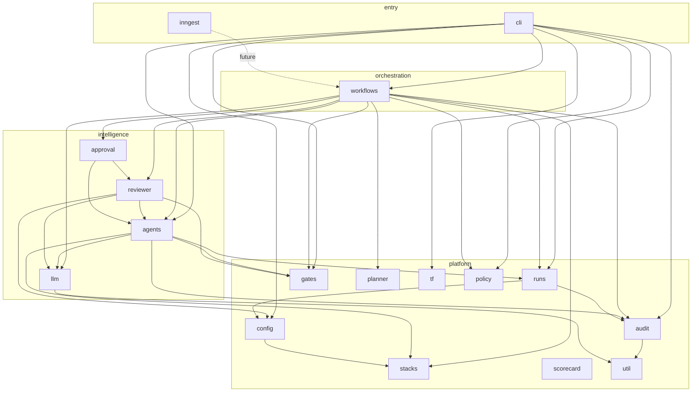

---

## spec: 2026-05-05-clean-code-enforcement
created: 2026-05-05
updated: 2026-05-05
tags: [layers, dependency-cruiser]

# Layer map — `src/`

Intended dependency direction (higher layers **may** depend on lower; not the reverse). Enforced subsets are in `**.dependency-cruiser.js`** (`forbidden` rules); this doc is the human-readable map.

## Top-level packages (by role)

| Folder       | Role                                                                                                        |
| ------------ | ----------------------------------------------------------------------------------------------------------- |
| `util/`      | Leaf helpers (no imports from other `src/` trees).                                                          |
| `runs/`      | Run identity, spec load, durable state, orchestrator context schema.                                        |
| `config/`    | Env, expectations, managed-repo config (may use `stacks/`).                                                 |
| `stacks/`    | Stack profiles / registry.                                                                                  |
| `audit/`     | JSONL writer + hash chain verify.                                                                           |
| `gates/`     | Quality invocations, caveman mask (no workflow composition).                                                |
| `planner/`   | O5 dry-run (node-only; no app imports today).                                                               |
| `llm/`       | Prompt assembly, TOON context.                                                                              |
| `agents/`    | Mastra-shaped agents + schemas (may use `gates/`, `llm/`, `stacks/`, `runs/` types).                        |
| `reviewer/`  | Deterministic reviewer + diff helpers.                                                                      |
| `approval/`  | Approval artifact formatting.                                                                               |
| `policy/`    | HITL / policy (throws `**CliArgError**` from `**src/errors/CliArgError.js**` — shared with `**cli/args**`). |
| `workflows/` | Planner / supervisor / execute / integration orchestration.                                                 |
| `cli/`       | Entry orchestration; may import workflows, agents mocks, TF, runs.                                          |
| `scorecard/` | Read-only-ish aggregation over audit.                                                                       |
| `tf/`        | Terraform client + cache.                                                                                   |
| `inngest/`   | Durable wrapper (thin; fuller wiring deferred).                                                             |

## Diagram (intent)

## Machine-enforced edges (today)

See `.dependency-cruiser.js`:

1. `**src/runs/**` → must not depend on → `src/workflows/****` — runs are primitives; workflows compose them.
2. `**src/util/**` → must not depend on → other `src/**` subtrees** — util stays leaf.
3. `**src/gates/`** → must not depend on → `src/workflows/****` — gates stay test/run hooks, not orchestration.

Expand `forbidden` when a boundary is clarified (e.g. policy vs cli error types).